本章描述了着色器程序可见的状态变量。除非另有说明，否则每个波都有该状态的私有副本
## 状态概览
下表显示了着色器程序可读或可写的硬件状态。除了共享的 TBA 和 TMA 之外，下面的所有寄存器对于每个波形都是唯一的。
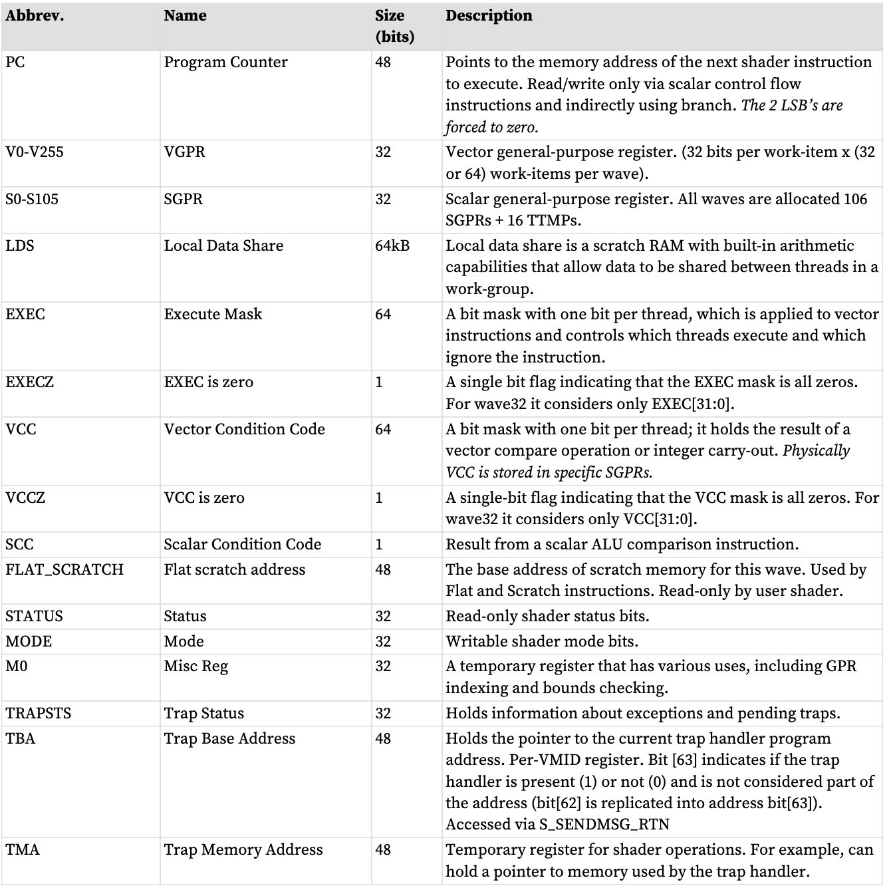

## 控制状态：PC和EXEC
### 程序计数器PC
程序计数器是一个双字对齐的字节地址，指向下一条要执行的指令。创建波形时，PC 会初始化为程序中的第一条指令。
有一些指令可以直接与 PC 交互：S_GETPC_B64、S_SETPC_B64、S_CALL_B64、S_RFE_B64 和 S_SWAPPC_B64。它们在偶数对齐的 SGPR 对（符号扩展）之间传输 PC。
分支跳转到(PC_of_the_instruction_after_the_branch + offset*4)。分支，GET_PC 和 SWAP_PC 是 PC 相对于下一条指令，而不是当前指令。另一方面，S_TRAP 保存 S_TRAP 指令本身的 PC。
在波形调试期间，可以读取程序计数器。 PC 指向下一条要发出的指令。所有先前的指令均已发出，但可能已完成执行，也可能未完成执行。
### 执行掩码
执行掩码（64 位）控制执行向量中的哪些线程。每一位指示一个线程对于向量指令的行为方式：1 = 执行，0 = 不执行。 EXEC 可以通过标量指令读写，也可以作为向量-alu 比较的结果写入。 EXEC 影响：向量 alu、向量内存、LDS、GDS 和导出指令。它不影响标量执行或分支。

Wave64 使用所有 64 位执行掩码。 Wave32 波形仅使用位 31:0，硬件不会对高位进行操作。

有一个摘要位 (EXECZ) 指示整个执行掩码为零。当 EXEC 为零时，它可以用作分支跳过代码的条件。对于wave32，这反映了EXEC[31:0]的状态。
### 指令跳过：EXEC==0
* 当 EXEC==0 时，着色器硬件可能会跳过向量指令。可以跳过的指令有：
    * VALU - 如果 EXEC == 0 则跳过 如果指令写入 SGPR/VCC，则不跳过 
    * 不跳过 WMMA 或 SWMMA
    * 这种跳过是机会性的，可能不会发生，具体取决于 V_CMPX 之后的时序。
* 无论 EXEC 掩码值如何，都不会跳过这些，并且在 wave64 中仅发出一次 
    *  V_NOP、V_PIPEFLUSH、V_READLANE、V_READFIRSTLANE、V_WRITELANE
    *  BUFFER_GL1_INV、BUFFER_GL0_INV 
* 无论 Wave64 模式下的 EXEC 掩码值如何，都不会跳过这些并发出两次 
    * 写入 SGPR 或 VCC 的 V_CMP（不是 V_CMPX - 可以跳过一次，但不能跳过两次）
    * 写入 SGPR 的任何 VALU
* 导出请求 - 跳过，除非： Done==1 或导出目标为 POS0 
    * 如果使用以下命令创建波形，则跳过SKIP_EXPORT=1 
* LDS_param_load / LDS-direct：当 EXEC==0 且 EXP_cnt==0 时跳过 
* LDS、内存、GDS - 不跳过 ◦ 
    * 仅当满足以下条件时才能跳过 VMEM：VMcnt/VScnt==0 且 EXEC== 0
        * 否则，对于wave64，如果该一半的 EXEC==0 则可以跳过一轮，但不能跳过两半。 
    * 仅当满足以下条件时才能跳过 LDS：LGKMcnt==0 且 EXEC==0 
    * 不跳过 GDS 或 GWS
## 存储器状态：：SGPR、VGPR、LDS
### SGPRs
#### SGPR分配和存储
每个 Wave（波？） 都分配固定数量的 SGPR：
* 106 个正常 SGPR
* VCC_HI 和 VCC_LO（存储在 SGPR 106 和 107 中）
* 16个陷阱临时 SGPR，供陷阱处理​​程序使用
#### VCC 电压控制电路
向量条件代码 (VCC) 可由 V_CMP 和整数向量 ADD/SUB 指令写入。 VCC 由 V_ADD_CI、V_SUB_CI、V_CNDMASK 和 V_DIV_FMAS 隐式读取。 VCC 是一个命名的 SGPR-pair，并且与任何其他 SGPR 一样受到相同的依赖性检查。
#### SGPR 对齐
有几种情况需要偶数对齐 SGPR：
* 任何时候使用 64 位数据这包括移至 64 位寄存器或从 64 位寄存器移出，包括 PC 2。
* 当地址基数来自 SGPR-pair 时，标量存储器读取

对于超过 64 位的操作以及当标量内存操作（读、写或原子）对超过 2 个 DWORD 进行操作时的数据 GPR 需要 SGPR 的四对齐。类似地，当 64 位 SGPR 数据值用作 VALU 操作的源时，无论大小如何，它都必须均匀对齐。相反，当 32 位 SGPR 数据值用作 VALU 操作的源时，它可以任意对齐，无论波大小如何。

当 64 位数量存储在 SGPR 中时，LSB 位于 SGPR[n] 中，MSB 位于 SGPR[n+1] 中。
对于大于 32 位的数据使用未对齐的源或目标 SGPR 是非法的，并且结果是不可预测的。

例如，具有进位输入或进位输出的 VALU 操作：
• 当与wave32 一起使用时，这些是32 位值并且可以任意对齐 
• 当与wave64 一起使用时，这些是64 位值并且必须与偶数SGPR 地址对齐

硬件通过根据需要忽略 LSB 并将其视为零来强制执行 SGPR 对齐。对于* MOVREL *_B64，索引的LSB也被忽略并被视为零。
#### SGPR 超出范围行为
标量源和目标使用 7 位编码：
    标量 0-105=SGPR； 106，107=VCC，108-123=TTMP0-15，以及124-127={NULL，M0，EXEC_LO，EXEC_HI}。
使用 GPR 索引或多 DWORD 操作数跨 SGPR 区域是非法的。这些地区是：
• SGPR 0 - 107（包括VCC） 
• 陷阱临时SGPRs 
• 不得对所有其他SGPR 和标量源地址进行索引，并且单个操作数不能引用多个寄存器范围。

一般规则：
* 超出范围的源 SGPR 返回零（当 STATUS.PRIV=0、NULL、M0 或 EXEC 不允许时使用 TTMP） 
* 对超出范围的 SGPR 的写入将被忽略

TTMP0-15 只能在陷阱处理程序 (STATUS.PRIV=1) 中写入，并且不能由用户着色器读取（当 STATUS.PRIV=0 时返回零）。在陷阱处理程序之外对 TTMP 的写入将被忽略。尝试写入 TTMP 但失败的 SALU 指令也不会更新 SCC。
* SALU：适用上述规则。 
    * 即使SDST 超出范围，WREXEC 和SAVEEXEC 也会写入EXEC 掩码。 
* VALU：适用上述规则。
* VMEM：S#、T#、V# 必须包含在一个区域内。
    * T# (128b)、V# 或 S#：不存在可能的范围违规（强制对齐将所有内容置于 1 个范围内）。 
    * T# (256b) 从 104 开始并延伸至 TTMP；或者从 TTMP12 开始并超过 TTMP15 属于违规。如果发生这种情况，请强制使用 S0。
* SMEM 返回从SGPR/VCC 开始并扩展到TTMP 中的数据，或者从TTMP 中开始并扩展到TTMP 之外的数据将超出范围。
    * 不会将任何数据写入超出范围的 dest-SGPR 
    * Addr 和写入数据对齐，因此不会超出范围，但以下情况除外：
        * 引用 M0、NULL 或 EXEC* 返回零，并且 SMEM 加载无法加载到这些寄存器中。
* S_MOVREL： 
    * 只能在SGPR 和TTMP 内建立索引，并且不得在两者之间交叉。索引必须保持在“基数”范（索引 == 0 的操作数类型）。范围为：[ SGPR 0-105 和 VCC_LO、VCC_HI ]、[ 陷阱温度 0-15 ]、[ 所有其他值 ] 
    * 索引不得达到 M0、exec 或内联常量，规则为：
        * 基址为 SGPR：addr > VCC_HI（或者如果是 64 位操作数，则 addr > VCC_LO）
        *基址为 TTMP：addr > TTMP15（或者如果 addr > ttmp14，则为 B64） 
    * 如果源超出范围，则使用 S0。
    * 如果目标超出范围，则不会写入任何内容。
###  VGPRs
#### VGPR 分配对齐
VGPRs 以 16 个（wave32）块或 8 个（wave64）块的形式分配，一个着色器最多可以有 256 个 VGPRs。在换句话说，VGPR 以（16 * 32 或 8*64 = 512 DWORD）为单位进行分配。 VGPR 为零时可能无法创建波。每个 SIMD 有 1536 个 VGPRs 的设备以 24 个块的形式分配给 wave32，以 12 个块的形式分配给 wave64。

波可以通过 S_SENDMSG 自愿释放其所有 VGPRs。完成此操作后，wave 可能不会重新分配它们，唯一有效的操作是终止 wave。如果波形已向内存发出存储并在终止之前等待写入确认，则这可能很有用。在等待时释放 VGPR 可能会允许新的一波分配它们并更早开始。
#### VGPR 超出范围行为
给定一个使用 VGPR 数据的一个或多个 DWORD 的指令操作数：“V”
    Vs = 第一个 VGPR DWORD（开始） 
    Ve = 最后一个 VGPR DWORD（结束）
    
对于32位操作数，Vs==Ve；对于 64 位操作数 Ve=Vs+1 等

如果出现以下情况，则操作数超出范围：
* Vs < 0 || Vs >= VGPR_SIZE
* Ve < 0 || Ve >= VGPR_SIZE

V_MOVREL 索引操作数超出范围，如果：
* 指数 > 255
* (Vs + M0) >= VGPR_SIZE
* (Ve + M0) >= VGPR_SIZE

超出范围后果：
* 如果目标VGPR 超出范围，则该指令将被忽略（视为NOP)
* V_SWAP 和V_SWAPREL ：由于两个参数都是目标，如果其中一个超出范围，则丢弃该指令。
    * 具有多个目标的 VALU 指令（例如 VGPR 和 SGPR）：不会向任何 GPR 写入任何内容
* 如果源 VGPR 超出 VMEM 或导出指令中的范围：使用 VGPR0 
    *  使用一组连续 VGPRs 的内存指令超出范围 使用 VGPR0 作为各个超出范围的 VGPRs
* 如果VALU 指令中的源VGPR 超出VALU 指令中的范围： VGPR0 
    * VOPD 具有不同的规则：源地址强制为(VGPRaddr % 4)。

具有多个目标的指令（例如 V_ADD_CO）：如果任何目标超出范围，则不会写入任何结果。
### 内存对齐和超出范围行为
本节定义当源或目标 GPR 或内存地址超出波形的合法范围时的行为。除非另有说明，这些规则适用于 LDS、GDS、缓冲区、全局、平面和暂存存储器访问。

内存、LDS 和 GDS：读取和原子并返回：
* 如果任何源VGPR 或SGPR 超出范围，则数据值未定义。
* 如果任何目标 VGPR 超出范围，则通过发出指令使操作无效，就像 EXEC 掩码被清除为 0 一样。
    * 此超出范围测试会检查所有可返回的 VGPR（例如，对于 BUFFER_LOAD_B128，从 VDST 到 VDST+3） 
    * 此检查还包括额外的 PRT（部分驻留纹理）VGPR，并在该 VGPR 超出时使提取无效范围，无论纹理系统是否实际返回该值。 
    * 目标 VGPR 超出范围的原子操作无效：已发出，但 EXEC 掩码为零。
* 在做出越界判断时，图像加载和存储会考虑DMASK 位。
* 注意：VDST 仅检查实际返回值的 lds/gds/mem-atomic。

VMEM（纹理）内存对齐规则是使用配置寄存器：SH_MEM_CONFIG.alignment_mode 定义的。此设置还会影响 LDS、Flat/Scratch/Global 操作。
DWORD 自动对齐到元素大小或 DWORD 中较小者的倍数。
UNALIGNED 无对齐要求。

BUFFER_LOAD_FORMAT_* 等格式化操作必须按如下方式对齐：
• 1 字节格式需要 1 字节对齐 
• 2 字节格式需要 2 字节对齐 
• 4 字节及更大格式需要 4 字节对齐

原子必须与数据大小对齐，否则会触发 MEMVIOL。
### LDS（Local Data Share）
可以为波分配 LDS 内存，并且工作组中的波都共享相同的 LDS 内存分配。一个wave可以分配0-64kbyte的LDS空间，并且它是以1024字节的块的形式分配的。对 LDS 的所有访问都仅限于分配给该 wave/工作组的空间。

LDS 内部由两块 64kB 的存储器组成。这两个块中的每一个都与一个 CU 或另一个 CU 相关联：CU0 的字节地址为 0-65535，CU1 的字节地址为 65536-131071。将 LDS 空间分配给 wave 或工作组不会回绕：分配起始地址小于结束地址。

在 CU 模式下，wave 的整个 LDS 分配与加载 wave 时驻留在 LDS 的同一“侧”。不允许任何通道跨越或绕到另一侧。

在 WGP 模式下，wave 的 LDS 分配可能完全位于 LDS 的 CU0 或 CU1 部分中，也可能跨越边界并部分位于每个 CU 中。 LDS 存储的位置与波位于哪个 CU 上无关。

像素参数被加载到波驻留的同一 CU 侧，并且不会交叉到 LDS 存储的另一侧。像素着色器仅在 CU 模式下运行。除了顶点参数所需的空间之外，像素着色器还可能请求额外的 LDS 空间。
#### LDS/GDS 对齐和超出范围
如果对齐模式设置为“未对齐”，任何大小的 DS_LOAD 或 DS_STORE 都可以字节对齐。对于所有其他对齐模式，LDS 通过将地址最低有效位清零来强制对齐。

• 32 位原子必须与4 字节地址对齐； 64 位原子到 8 字节地址。 
• 如果LDS 地址超出范围且LDS_CONFIG.ADDR_OUT_OF_RANGE_REPORTING==1，LDS 操作会报告MEMVIOL。
• 当对齐模式设置为STRICT 或DWORD_STRICT 时，会报告未对齐的LDS 访问MEMVIOL。

超出范围：
* 如果LDS-ADDRESS 超出范围（addr < 0 或>= LDS_size）： 
    * 超出范围的写入将被丢弃。
    * 读取返回值零。对于多 DWORD 读取，如果 LDS 地址的任何部分超出范围，则整个指令将返回零。
* 如果任何源VGPR 超出范围，则使用VGPR0 中的值来提供LDS 地址或数据。 
* 如果dest-VGPR 超出范围，则使指令无效（EXEC=0 时发出）

LDS 和 GDS 中的“本地”对齐是：
* B8：字节对齐
* B16 或 D16：2 字节对齐
* B32：4字节对齐
* B64：8字节对齐
* B128 和 B96：16 字节对齐
如果对齐模式设置为“未对齐”，LDS 将禁用其自动对齐功能，并且不会报告未对齐读写的错误。
```
if (sh_alignment_mode == unaligned) align = 0xffff
else if (B32) align = 0xfffC
else if (B64) align = 0xfff8
else if (B96 or B128) align = 0xfff0
LDSaddr = (addr + offset) & align
```
## 波状态寄存器
以下寄存器不经常访问，只能通过 S_GETREG 和 S_SETREG 指令读写。其中一些寄存器是只读的，一些是可写的，而其他寄存器仅在陷阱处理程序（“PRIV”）中时才可写。
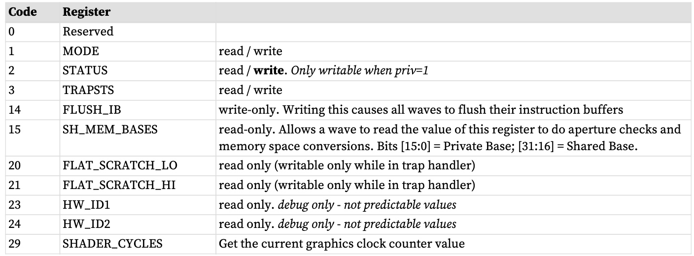
### 状态寄存器
着色器可以读取状态寄存器字段，但不能写入。在陷阱处理程序中，可以写入某些状态字段。这些位在波形创建时初始化。下表描述了状态寄存器字段。


### 模式寄存器
着色器可以通过标量指令读取和写入模式寄存器字段。下表描述了模式寄存器字段。

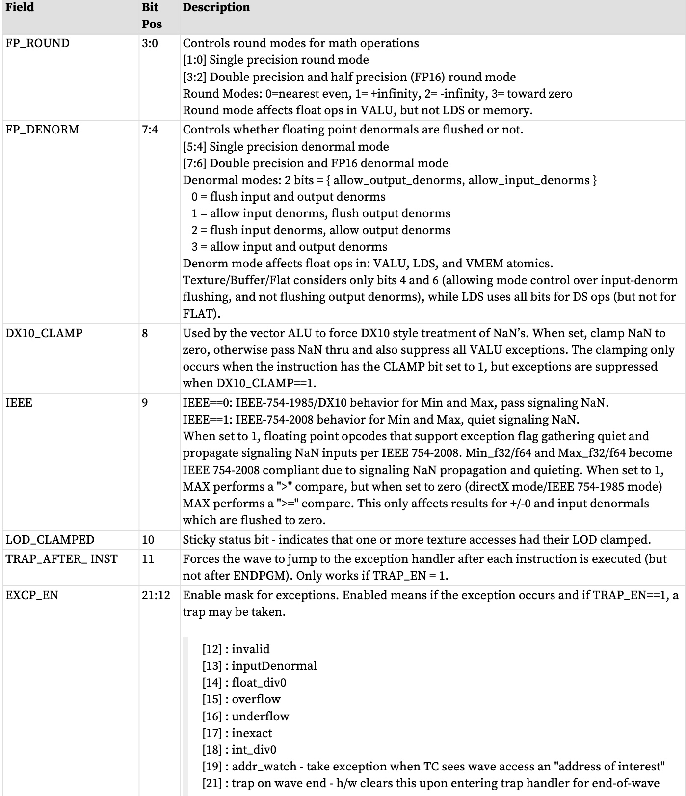

### M0：杂项寄存器
每个波形有一个 32 位 M0 寄存器，它用于：
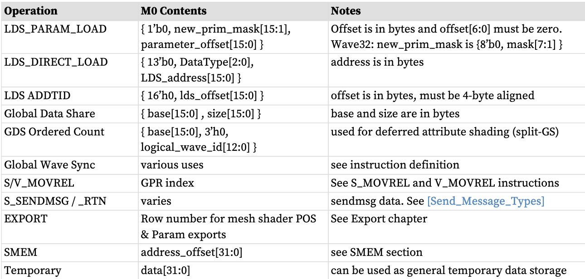
M0 只能由标量 ALU 写入。
### NULL
NULL 是标量源和目标。读取 NULL 返回零，写入 NULL 无效（写入数据被丢弃）。
NULL 可以用在通常可以使用标量源的任何地方：
* 当NULL 用作SALU 指令的目标时，指令执行：不写入SDST，但更新SCC（如果指令正常更新SCC）。
* NULL 不能用作S#、V# 或T#。
### SCC：标量条件代码
许多标量 ALU 指令设置标量条件代码 (SCC) 位，指示运算结果。
* 比较操作：1 = true
* 算术运算： 1 = 执行位
* 逻辑运算： 1 = 结果不为零
* 移动： 不改变 SCC

SCC 可用作扩展精度整数算术的进位输入，以及条件移动和分支的选择器。
### 矢量比较：VCC 和 VCCZ
矢量 ALU 比较指令 (V_CMP) 比较两个值并返回结果的位掩码，其中每一位代表一个通道（工作项），其中：1= 通过，0 = 失败。该结果掩码是矢量条件代码（VCC）。 VCC 还针对选定的整数 ALU 运算（进位）进行设置。

这些指令将此掩码写入 VCC、SGPR 或 EXEC，但不会同时写入 EXEC 和 SGPR。 Wave32仅写入VCC、EXEC或单个SGPR的低32位； Wave64 写入 64 位 VCC、EXEC 或一对对齐的 SGPR。

每当任何指令向 VCC 写入值时，硬件都会自动更新称为 VCCZ 的“VCC 摘要”位。该位指示当前波形大小的整个 VCC 掩模是否为零。 Wave32 忽略 VCC[63:32]，仅 [31:0] 位对 VCCZ 有贡献。这对于提前退出分支测试很有用。 VCC 还针对某些整数 ALU 运算（进位）进行设置。

EXEC 掩码确定哪些线程执行指令。 VCC 指示哪些执行线程通过了条件测试，或者哪些线程从整数加法或减法生成了进位。

```
S_MOV_B64 EXEC, 0x00000001 // set just one thread active; others are inactive
V_CMP_EQ_B32 VCC, V0, V0 // compare (V0 == V0) and write result to VCC (all bits in VCC are
updated)
```
VCC 物理上驻留在 SGPR 寄存器文件中的一对特定的 SGPRs 中，因此当指令源 VCC 时，这将计入给定指令可源的 SGPR 总数的限制。
Wave32 波可以使用任何 SGPR 进行掩码/进位/借位操作，但不能使用 VCC_HI 或 EXEC_HI。
### FLAT_SCRATCH（平面刮擦）
FLAT_SCRATCH 是一个 64 位寄存器，保存指向该波形暂存存储器基址的指针。对于已分配暂存空间的波形，波形启动硬件使用该波形唯一的暂存基地址来初始化 FLAT_SCRATCH 寄存器。该寄存器是只读的，除非在陷阱处理程序中它是可写的。该值是一个字节地址，并且必须是 256 字节对齐。如果 Wave 没有分配暂存空间，则读取 FLAT_SCRATCH 将返回零。

FLAT_SCRATCH 的值在硬件中计算并为分配了暂存空间的任何波形进行初始化：
* scratch_base = scratch_base[63:0] + spi_scratch_offset[31:0]
* FLAT_SCRATCH_LO = scratch_base [31:0]
* FLAT_SCRATCH_HI = scratch_base [63:32]
### 硬件内部寄存器
这些寄存器是只读的，可以通过 S_GETREG 指令访问。它们返回有关硬件分配和状态的信息。 HW_ID 和各种 *_BASE 值是不可预测的，并且如果可能发生上下文切换，则可能会在波形的生命周期内发生变化。
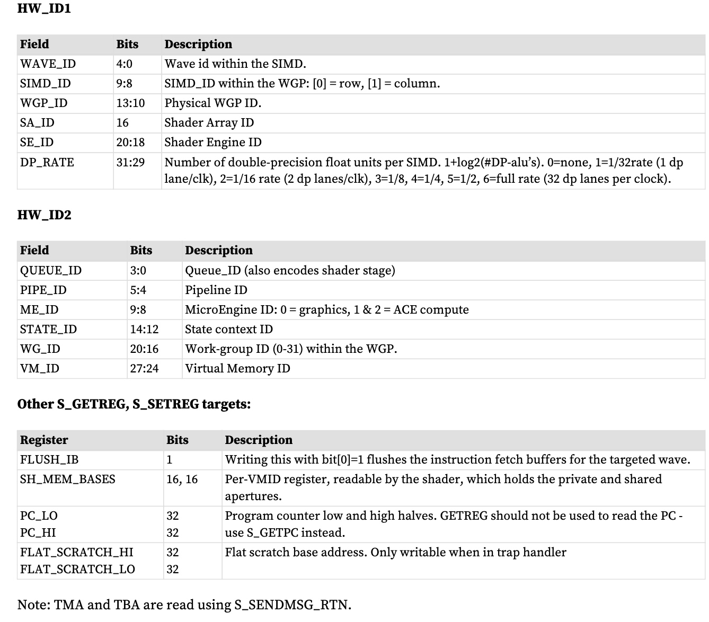
### 陷阱和异常寄存器
每种类型的异常都可以通过设置或清除 TRAPSTS 寄存器的 EXCP_EN 字段中的位来独立启用或禁用。本节介绍控制和报告着色器异常的寄存器。

陷阱临时 SGPR (TTMP*) 具有写入权限 - 仅当在陷阱处理程序中时才能写入它们（状态.PRIV = 1）。用户着色器无法读取 TTMP（返回零）。

当着色器没有特权时 (STATUS.PRIV==0)，对这些的写入将被忽略。 TMA 和 TBA 是只读的；可以通过 S_SENDMSG_RTN 访问它们。

当捕获（用户启动、异常或主机启动）时，着色器硬件会生成 S_TRAP 指令。这会将陷阱信息加载到一对 SGPRS 中：
{TTMP1, TTMP0} = {7'h0, HT[0],trapID[7:0], PC[47:0]}.

对于主机启动的陷阱，HT 设置为 1，对于用户陷阱 (s_trap) 或异常，HT 设置为 0。对于异常，TRAP_ID 为零，或者对于这些陷阱，TRAP_ID 为零。

**STATUS . TRAP_EN**
该位告诉着色器陷阱处理程序是否存在。当陷阱不存在时，无论陷阱是浮点、用户还是主机启动的陷阱，都不会被捕获。当存在陷阱处理程序时，wave 使用额外的 16 个 SGPR 进行陷阱处理。
如果trap_en == 0，则忽略所有陷阱和异常，并且s_trap由硬件转换为NOP。

**MODE . EXCP_EN[8:0]**
异常启用掩码。定义当异常发生时，哪个异常源导致着色器跳转到陷阱处理程序。 1 = 启用陷阱； 0 = 禁用陷阱。MEMVIOL 和非法指令跳转到陷阱处理程序并且无法被屏蔽。

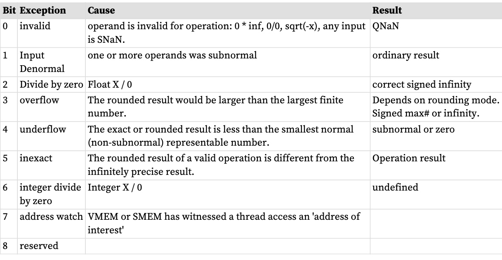

**TRAPSTS 寄存器**
TRAPSTS 包含有关陷阱和异常的信息，并且可以由用户着色器或陷阱处理程序写入。
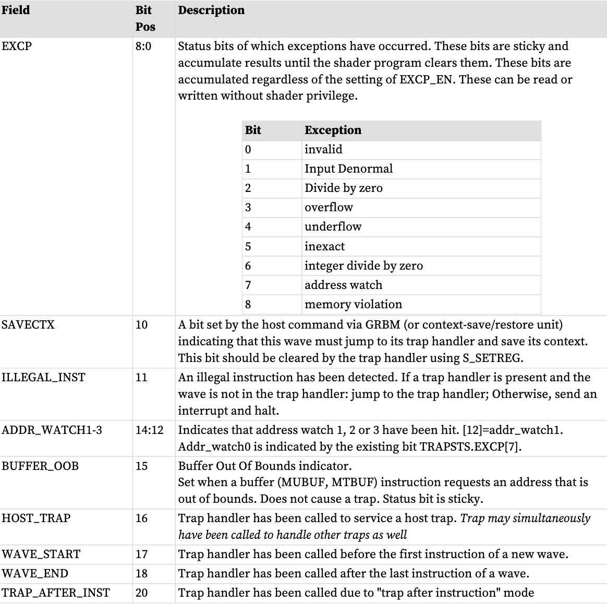
### 时间
在着色器中测量时间有两种方法：
• “TIME” - 测量图形核心时钟周期（20 位计数器）
• “REALTIME” - 基于固定频率、持续运行的时钟（通常为100MHz）测量时间，提供64 位值。

着色器程序可以访问自由运行的时钟计数器，以测量波形执行部分的持续时间。该计数器可通过“S_GETREG S0, SHADER_CYCLES”读取，并返回 20 位周期计数器值。该计数器在不同的 SIMD 之间不同步，只能用于测量一个波内的时间增量。读取计数器是通过 SALU 处理的，其典型延迟约为 8 个周期。

要测量不同波形或 SIMD 之间的时间，或者要参考芯片空闲时不停止计数的时钟，请使用“REALTIME”。实时是来自时钟生成器的时钟计数器，无论着色器或内存时钟速度如何，都以恒定速度运行。该计数器可以通过以下方式读取：
```
S_SENDMSG_RTN_B64 S[2:3] REALTIME
S_WAITCNT LGKMcnt == 0
```
## 初始波状态
在波形开始执行之前，包括 SGPR 和 VGPR 在内的一些状态寄存器会使用从状态数据、动态或导出数据（例如插值或唯一的每波形数据）导出的值进行初始化。这些值源自寄存器状态和动态波发射状态。

请注意，此状态中的某些状态在绘制调用中的所有 Wave 中是通用的，而其他状态对于每个 Wave 来说是唯一的。
本节描述每个着色器阶段初始化的状态。请注意，与本规范中一样，着色器阶段指的是硬件着色器阶段，这些阶段通常与软件着色器阶段不同。

状态初始化由其他文档中定义的状态寄存器控制。
### 执行初始化
通常，EXEC 是使用波形中处于活动状态的线程的掩码来初始化的。然而，在某些情况下，EXEC 掩码被初始化为零，表明该波形不应执行任何操作并立即退出。
这些被称为“空波”(EXEC==0)，并在开始执行后立即退出。
### FLAT_SCRATCH 初始化
分配有暂存内存空间的 Wave 使用其 FLAT_SCRATCH 寄存器进行初始化，该寄存器具有指向全局内存地址的指针。没有划痕的波将其初始化为零。
### SGPR初始化
SGPR 根据各种 SPI_PGM_RSRC* 或 COMPUTE_PGM_* 寄存器设置进行初始化。请注意，仅加载启用的值，并将它们打包到连续的 SGPR 中，无论加载的用户常量数量如何，都会跳过禁用的值。对齐时不会跳过任何 SGPR。

下表显示了如何控制在着色器启动之前初始化哪些值。
#### 像素着色器（PS）


**PS_wave_index is** (se_id[1:0] * GPU__GC__NUM_PACKER_PER_SE + packer_id)
**PS_wave_id**是针对每个波递增的索引值。每个打包器都有一个单独的计数器，因此 { ps_wave_id, ps_wave_index } 的组合形成芯片上任何 Wave 的唯一 ID。 wave-id 计数器在 SPI_PS_MAX_WAVE_ID 处回绕。
#### 几何着色器（GS）
ES 和 GS 作为 GS 型的联合浪潮推出。着色器被初始化为 GS 波类型，PC 指向 ES 着色器并预加载 GS 用户 SGPR，以及指向更多 GS 用户 SGPR 的内存指针。着色器首先执行ES程序，完成后执行GS着色器。一旦 ES 着色器完成，它可以重新使用包含 ES 用户数据和 GS 着色器地址的 SGPRs。

前 8 个 SGPR 会自动初始化 - 不会跳过任何值（未使用的值会写为零）。
状态寄存器：
* SPI_SHADER_PGM_{LO,HI}_ES：GS 着色器的地址 
* SPI_SHADER_PGM_RSRC1：组合 ES + GS 着色器的资源 
    * GS_VGPR_COMP_CNT = 要加载的 GS VGPR 数量（2 位） 
* SPI_SHADER_PGM_RSRC2：组合 ES + GS 着色器的资源 
    *  VGPR_COMP_CNT =要加载的 VGPR 数量（2 位） 
    * OC_LDS_EN 
* SPI_SHADER_PGM_RSRC{3,4}：组合 ES + GS 着色器的资源 

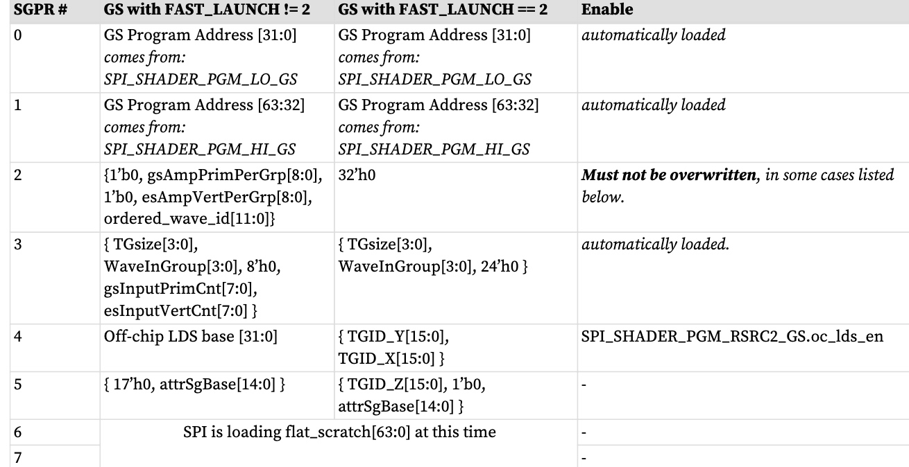


当使用流输出时，在发出最终流输出之前（“完成”= 1 的 GDS 有序计数），不得修改或覆盖 SGPR[2]。这是因为硬件自动执行的流水线复位序列读取SGPR来构造GDS有序计数指令并依赖于该值。
#### 前端着色器（HS）
LS 和 HS 作为 HS 型的组合波推出。着色器被初始化为 HS 波形类型，PC 指向 LS 着色器并预加载 HS 用户 SGPR，以及指向更多 HS 用户 SGPR 的内存指针。着色器首先执行 LS 程序，完成后执行 HS 着色器。一旦 LS 着色器完成，它可以重新使用包含 LS 用户数据和 HS 着色器地址的 SGPR。

前 8 个 SGPR 会自动初始化 - 不会跳过任何值（未使用的值会写为零）。
其他寄存器：
* SPI_SHADER_PGM_{LO,HI}_LS：LS 着色器的地址 
* SPI_SHADER_PGM_RSRC1：组合 LS + HS 着色器的资源 
    * LS_VGPR_COMP_CNT = 要加载的 LS VGPR 数量（2 位） 
* SPI_SHADER_PGM_RSRC{2,3,4}：组合 LS + HS 着色器的资源LS + HS 着色器

#### 计算着色器（CS）

### 哪些 VGPRs 已初始化
该表显示了可以在 Wave 启动之前初始化的 VGPR。 COMPUTE_PGM_RSRC* 或 SPI_SHADER_PGM_RSRC* 控制寄存器可以为每个着色器阶段选择一个缩减集。

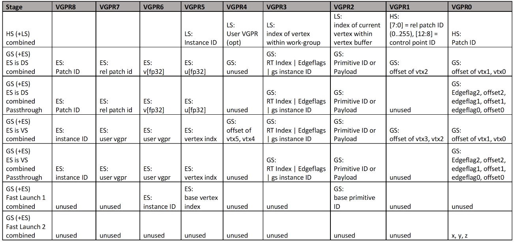

#### 像素着色器 VGPR 输入控制
**像素着色器** VGPR 输入加载要复杂一些。有一个 CAM 将 VS 输出映射到 PS 输入。在需要加载的 PS 输入中，它们按以下顺序加载

两个寄存器（SPI_PS_INPUT_ENA 和 SPI_PS_INPUT_ADDR）控制 IJ 计算的使能和 PS 波的 VGPR 初始化的指定。 SPI_PS_INPUT_ENA 用于确定为设置启用哪些梯度、是否启用每像素 Z、计算和/或通过重心逻辑传递哪些项以及将哪些项加载到 PS 的 VGPR 中。 SPI_PS_INPUT_ADDR 可用于操作由 INPUT_ENA 启用的项的 VGPR 目标，通常提供一种在从 INPUT_ENA 中删除项时保持一致的 VGPR 寻址的方法。当 ENA 中的相应位未置位时，设置 ADDR 中的位是有效的，但如果 ENA 位置位，则 ADDR 中的相应位也必须置位。

两个像素分级寄存器 (PSR) 控制寄存器包含一组相同的字段，并由以下内容组成：
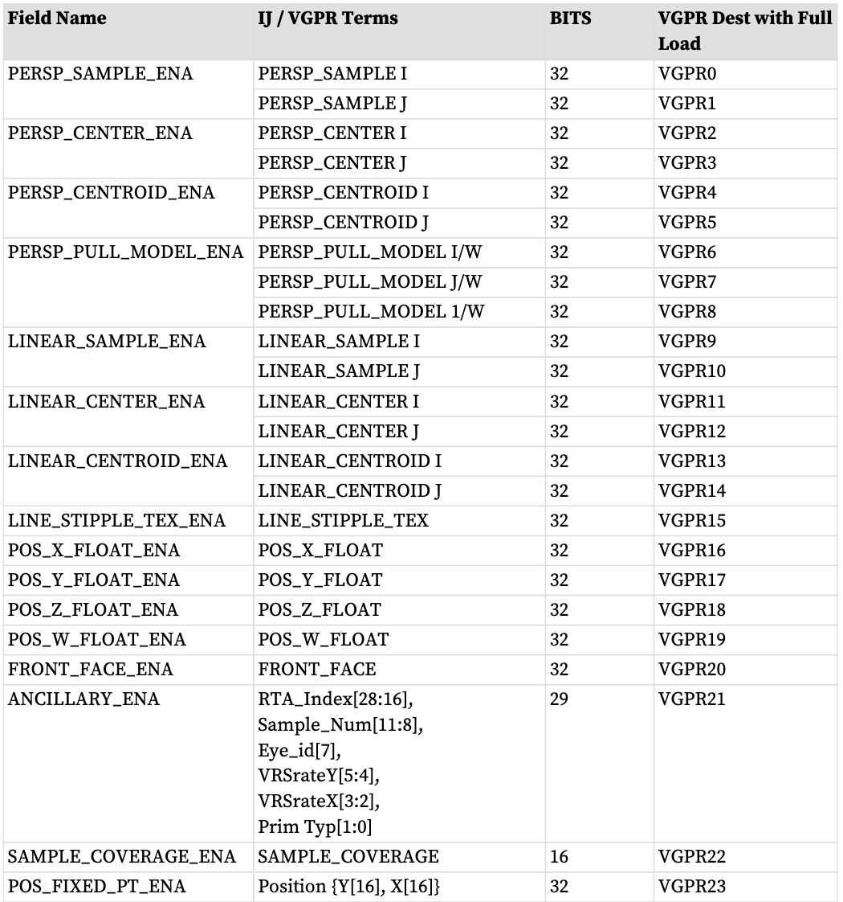

上表显示了启用所有可能的术语时 PS 的 VGPR 目的地。如果 PS_INPUT_ADDR == PS_INPUT_ENA，则由于项被禁用，PS VGPR 会向 VGPR0 打包，如下表所示：
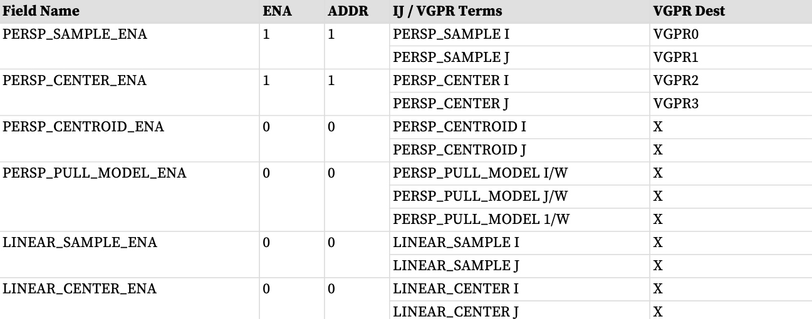

但是，如果 PS_INPUT_ADDR != PS_INPUT_ENA，则可以操纵启用项的 VGPR 目的地。下表显示了一个示例：
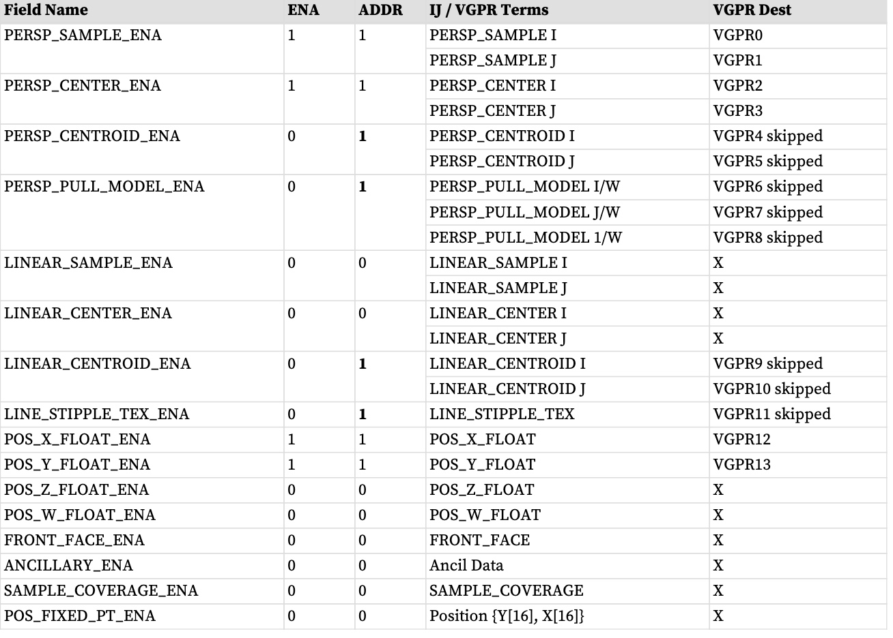
### LDS初始化
只有像素着色器 (PS) 波在波启动之前使用数据预先初始化了 LDS。对于 PS 波，LDS 预加载了顶点参数数据，可以使用重心（I 和 J）进行插值以计算每像素参数。


